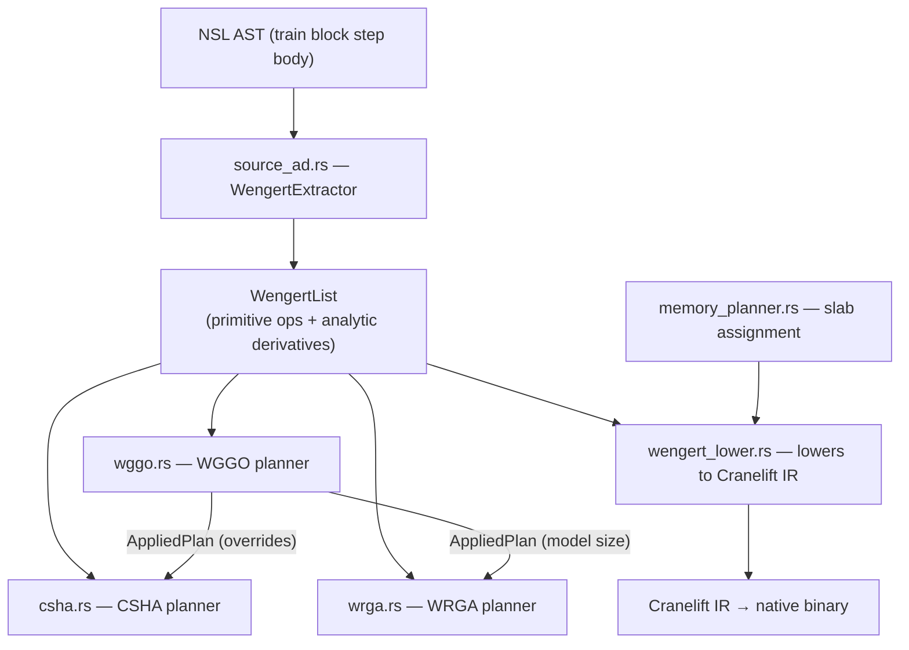

<!-- owner: @bwiemz -->

# Optimization Passes

NSL's compile-time optimization passes are the reason programs outperform a naive PyTorch transliteration. Each pass is an IR rewrite or a specialized code-synthesis step that runs before Cranelift emits the final binary. This page explains which passes exist, why they run in the order they do, and how to add a new one.

For the surrounding compiler stage, see [Compiler-Pipeline § Stage 4](Compiler-Pipeline.md#stage-4--codegen). Remember: **Cranelift is the sole function-emission backend**; passes described here either (a) rewrite the IR that Cranelift consumes, or (b) synthesize PTX text that gets embedded as a Cranelift data section.

## AOT autodiff — the WengertList

Source: [`crates/nsl-codegen/src/source_ad.rs`](../../crates/nsl-codegen/src/source_ad.rs).

NSL has **two** autodiff paths:

- **AOT (ahead-of-time) source AD** — `source_ad.rs` (`WengertExtractor`) walks the AST of a `train` block's step body and builds a `WengertList` (a straight-line SSA DAG of primitive ops plus their analytic derivatives) at compile time. The `WengertList` is then lowered by [`wengert_lower.rs`](../../crates/nsl-codegen/src/wengert_lower.rs) into **Cranelift IR** (as FFI calls into the NSL runtime). This is the fast path; dead-gradient elimination (`eliminate_dead_gradients`, `eliminate_by_backward_live`) prunes adjoint ops that contribute nothing to any trainable parameter.
- **Tape-based dynamic AD** — the fallback for constructs `source_ad.rs` cannot prove (dynamic shapes, data-dependent control flow). The step body falls back to `compile_tape_backward`. Slower; requires raw pointer lifetime discipline. See [Runtime-Internals § Autodiff tape](Runtime-Internals.md#autodiff-tape).

When source AD extraction succeeds, the `WengertList` becomes the shared input for every downstream optimization pass (WGGO, CSHA, WRGA).

Note: `WengertList` does NOT lower to PTX. Subsystem fusion passes (CSHA, WRGA, FlashAttention-2) synthesize PTX separately via their own templated emitters — see the per-subsystem sections below.

## Memory planning — the slab allocator

Source: [`crates/nsl-codegen/src/memory_planner.rs`](../../crates/nsl-codegen/src/memory_planner.rs).

M36 (compile-time memory planning) solves a liveness-based packing problem over the full program AST:

1. **`analyze_ast_liveness`** — walks the AST to find every static-shape tensor allocation and record its live interval (birth program-point to last-use program-point).
2. **`InterferenceGraph::build`** — constructs an interference graph where nodes are tensors and edges connect tensors that are simultaneously live.
3. **`plan_slab`** — colors the interference graph greedily; assigns each tensor a contiguous offset inside a single GPU memory slab. Non-interfering tensors share memory.
4. At program startup the slab is initialized by a single `nsl_gpu_slab_init` call (see [`compiler/main_entry.rs`](../../crates/nsl-codegen/src/compiler/main_entry.rs)); per-tensor offsets are constant-folded into the emitted Cranelift IR.

The memory planner runs **after** `compile_user_functions` and **before** `compile_main` (see [`compiler/entry_points.rs`](../../crates/nsl-codegen/src/compiler/entry_points.rs)). This sequencing is load-bearing: the slab plan must be complete before `compile_main` emits the initialization call.

**Verification target: 0 MB/step allocation growth.** If your change regresses this, the slab plan is incorrect. Use [`memory_timeline.rs`](../../crates/nsl-codegen/src/profiling/memory_timeline.rs) to inspect per-step allocation events. The `--memory-report` flag (`check_vram_budget` / `format_memory_report`) surfaces the slab summary at build time.

## Pass ordering

The optimization passes that operate on the `WengertList` run inside `compile_train_block` (invoked from `compile_main`). The order, as read from [`crates/nsl-codegen/src/stmt.rs`](../../crates/nsl-codegen/src/stmt.rs), is:

1. **FASE planning** — `fase::plan` / `fase::plan_with_overrides` is called **first**, before source AD, using `wggo_overrides` stashed by a prior WGGO run (or `None` on a fresh compile). Produces a `FasePlan` describing accumulation mode, update rule, and two-phase clip structure. FASE codegen (applying the plan) fires later in the same function.
2. **Source AD extraction** — `WengertExtractor::extract_stmts` builds the `WengertList`.
3. **Calibration** — optional; runs the calibration harness and populates `calibration_sidecar` if `--calibration-data` is set. Feeds gradient-importance scores to WGGO.
4. **WGGO** — `wggo::run_on_wengert_with_weights`; consumes the `WengertList` and emits a `WggoPlan` + `AppliedPlan`. Stashes `WggoOverrides` for all downstream passes (and for the NEXT compile's FASE planning).
5. **CSHA** — `csha::run_on_wengert`; consumes the `WengertList` + `WggoOverrides`; emits a `CshaPlan` and bridges it into kernel-site annotations (`last_csha_bridge`).
6. **WRGA** — `invoke_wrga_if_enabled`; consumes the `WengertList`; runs dead-gradient elimination (`wrga_prune`), rank allocation (`wrga_roofline`), memory planning (`wrga_memory`), and fusion decisions (`wrga_fusion`).
7. **CPDT** — `invoke_cpdt_if_enabled`; consumes the `AppliedPlan` from WGGO. **CPDT is a no-op unless WGGO produced a plan first.**
8. **Source-AD adjoint generation + lowering** — `AdjointGenerator` rewrites the pruned `WengertList` into an adjoint program; `wengert_lower` lowers it to Cranelift IR.
9. **Memory planner (M36)** — runs after all user-function bodies are compiled, before `compile_main`. See above.

**Pass ordering is load-bearing.** FASE planning reads `wggo_overrides` from the compiler state, which is set by a prior WGGO run — on a fresh first-pass compile, FASE falls back to `fase::plan` (no overrides). CSHA receives WGGO's `AppliedPlan` (via `WggoOverrides`) so per-layer fusion-level decisions from WGGO are honoured — or rejected with a diagnostic — by CSHA. CPDT hard-depends on WGGO: if `--wggo` is absent, `cpdt_plan` remains `None`. The memory planner (M36) must run after `compile_user_functions` and before `compile_main`; reversing this order means the slab-initialization call is emitted before the plan is computed.

## Per-pass descriptions

### CCR — Common-kernel Combination Rewriting

**No implementation file exists.** CCR is a research concept defined in [`docs/research/CCR.pdf`](../../docs/research/CCR.pdf). The Compiler-Pipeline page mentions it alongside the other passes for historical context; it is not a current implementation step. Do not link to a source file that does not exist.

---

### FASE — Fused Accumulation + Step + Epilogue

Source: [`crates/nsl-codegen/src/fase.rs`](../../crates/nsl-codegen/src/fase.rs) (core analysis), [`fase_optimizer.rs`](../../crates/nsl-codegen/src/fase_optimizer.rs) (update-rule codegen), [`fase_memory.rs`](../../crates/nsl-codegen/src/fase_memory.rs) (per-layer slot scheduling), [`fase_clip.rs`](../../crates/nsl-codegen/src/fase_clip.rs) (two-phase grad-clip), [`stmt_fase.rs`](../../crates/nsl-codegen/src/stmt_fase.rs) (codegen integration).

Design specs: [`docs/superpowers/specs/2026-04-14-fase-deferred-codegen-integration-design.md`](../../docs/superpowers/specs/2026-04-14-fase-deferred-codegen-integration-design.md), [`2026-04-15-fase-codegen-phase2-design.md`](../../docs/superpowers/specs/2026-04-15-fase-codegen-phase2-design.md).

Given a `train` block configuration (optimizer, gradient accumulation count, clipping setting), `fase::plan` produces a `FasePlan` that the backward-codegen stage consumes. The plan describes: (1) whether to rewrite the backward at all (active only when `accumulation > 1`); (2) whether to run in **Deferred** mode (first-moment accumulation) or **Full** mode (standard gradient buffer, used when the optimizer does not match FASE invariants, e.g. Lion); (3) the mathematical update rule for the chosen optimizer, already specialised to the accumulation count; (4) the two-phase structure when `grad_clip` is enabled. The driver is pure — no state, no I/O — and produces the same output given the same inputs. PTX emission for the fused backward is handled by `fase_optimizer.rs` and `fase_memory.rs`.

Fires: **train-block only** (both planning and codegen run inside `compile_train_block`). The plan is a no-op (`FaseMode::Full` with N=1 scale) when `accumulation == 1`. Forward-only compilation and inference are unaffected.

---

### WGGO — Wengert Graph Global Optimization

Source: [`crates/nsl-codegen/src/wggo.rs`](../../crates/nsl-codegen/src/wggo.rs) (driver), plus sub-modules: [`wggo_cost.rs`](../../crates/nsl-codegen/src/wggo_cost.rs), [`wggo_dp.rs`](../../crates/nsl-codegen/src/wggo_dp.rs), [`wggo_gradient_scorer.rs`](../../crates/nsl-codegen/src/wggo_gradient_scorer.rs), [`wggo_apply.rs`](../../crates/nsl-codegen/src/wggo_apply.rs), [`wggo_conflicts.rs`](../../crates/nsl-codegen/src/wggo_conflicts.rs).

Research paper: [`docs/research/NSL-WGGO-Research.md.pdf`](../../docs/research/NSL-WGGO-Research.md.pdf).

The WGGO driver orchestrates eight stages (§5 of the research paper): (1) Wengert graph extraction (from `wengert.rs`); (2) cost-model annotation (`wggo_cost::build_lut`); (3) optional weight-analysis; (4) Level 1 inter-layer DP (`wggo_dp::solve`); (5) Level 2 per-layer ILP (greedy or templated solvers in `wggo_ilp`); (6) Level 3 kernel generation (delegated to backend); (7) memory planning (delegated to M36 `memory_planner.rs`); (8) communication schedule (`wggo_schedule::build_schedule`). The driver is pure data-in / data-out and has no backend side effects. It produces a `WggoPlan` (with embedded `AppliedPlan`) that all downstream passes consume as `WggoOverrides`. WGGO's `CoarseDecision::Prune` decisions are surfaced as `[prune]` diagnostics to stderr but the corresponding layer-to-residual-identity IR rewrite is not yet implemented — the diagnostic fires, the decision no-ops.

Fires: **train-block, when `--wggo <mode>` is set.** Pure advisory on forward-only builds.

---

### CSHA — Compiler-Synthesized Holistic Attention

Source: [`crates/nsl-codegen/src/csha.rs`](../../crates/nsl-codegen/src/csha.rs) (driver), plus sub-modules: [`csha_boundary.rs`](../../crates/nsl-codegen/src/csha_boundary.rs), [`csha_pipeline.rs`](../../crates/nsl-codegen/src/csha_pipeline.rs), [`csha_specialize.rs`](../../crates/nsl-codegen/src/csha_specialize.rs), [`csha_patterns.rs`](../../crates/nsl-codegen/src/csha_patterns.rs), [`csha_apply.rs`](../../crates/nsl-codegen/src/csha_apply.rs).

Research paper: [`docs/research/NSL-CSHA-Research.PDF`](../../docs/research/NSL-CSHA-Research.PDF).

Design specs: [`docs/superpowers/specs/2026-04-13-csha-tier-a-wiring-design.md`](../../docs/superpowers/specs/2026-04-13-csha-tier-a-wiring-design.md), [`2026-04-15-csha-tier-c-fused-backward-design.md`](../../docs/superpowers/specs/2026-04-15-csha-tier-c-fused-backward-design.md).

The CSHA driver orchestrates three passes (§3 of the research paper): (1) Level 1 boundary fusion (`csha_boundary`) — identifies adjacent attention sub-ops (RMSNorm, RoPE, matmul projections, softmax) that can be merged into a single tiled GPU kernel; (2) Level 2/3 pipelining/blocking (`csha_pipeline`) — selects tile configurations and SMEM budgets using a roofline model; (3) per-layer specialization (`csha_specialize`) — applies weight-aware and head-count-aware tuning. The driver is pure data-in / data-out; it receives `WggoOverrides` and honours (or rejects with a diagnostic) any per-layer fusion-level decision WGGO made. The resulting `CshaPlan` is bridged into `last_csha_bridge` so FlashAttention-2 call sites can route CSHA-active layers through CSHA-aware FFI. Synthesized FlashAttention-2 PTX (forward + backward) is emitted by [`compiler/kernel.rs::maybe_synthesize_csha_training_ptx`](../../crates/nsl-codegen/src/compiler/kernel.rs) and embedded as Cranelift data sections.

Fires: **`@flash_attention`-annotated models inside `@train`, when `--csha <mode>` is set.**

---

### WRGA — Wengert-Ranked Gradient Adapters

Source: [`crates/nsl-codegen/src/wrga_prune.rs`](../../crates/nsl-codegen/src/wrga_prune.rs) (Innovation 1 — dead gradient elimination), [`wrga_memory.rs`](../../crates/nsl-codegen/src/wrga_memory.rs) (Innovation 5 — activation-sharing memory planner), [`wrga_fusion.rs`](../../crates/nsl-codegen/src/wrga_fusion.rs) (Innovation 4 — fusion-integrated adapters). The WRGA driver that sequences these is invoked via `invoke_wrga_if_enabled` in [`stmt.rs`](../../crates/nsl-codegen/src/stmt.rs). Adapter-site pre-scan and model-method body rewrite are in [`wrga_prescan.rs`](../../crates/nsl-codegen/src/wrga_prescan.rs).

Research paper: [`docs/research/NSL-WRGA-Research.PDF`](../../docs/research/NSL-WRGA-Research.PDF).

Design specs: [`docs/superpowers/specs/2026-04-13-wrga-milestone-b3-design.md`](../../docs/superpowers/specs/2026-04-13-wrga-milestone-b3-design.md), [`2026-04-19-wrga-b32-option3-revised-design.md`](../../docs/superpowers/specs/2026-04-19-wrga-b32-option3-revised-design.md).

WRGA composes five innovations. Innovation 1 (`wrga_prune`) performs **dead gradient elimination**: given a `WengertList` and a set of trainable `VarId`s, it identifies the minimal subset of forward ops that participate in the backward pass and emits a pruned list — adjoint ops for frozen or irrelevant parameters are never generated. Innovation 4 (`wrga_fusion`) decides, per adapter site, whether the LoRA or IA³ adapter can be epilogue-fused into the host matmul or norm kernel. Innovation 5 (`wrga_memory`) solves activation-sharing via interference-graph colouring over Wengert `VarId` liveness, reusing the same greedy-colouring heuristic as M36 `memory_planner.rs` but driving it from the pruned backward graph (which is nearly trivial to colour because ~85% of forward ops carry no adjoint). Adapter site pre-scanning (`wrga_prescan`) rewrites `model_method_bodies` so the source-AD extractor sees fused FFI callees rather than raw PyTorch-style adapter calls. Fused LoRA / IA³ / GatedLoRA PTX is synthesized by [`wrga_fused_ptx.rs`](../../crates/nsl-codegen/src/wrga_fused_ptx.rs) and registered at startup via `emit_fused_ptx_registration`.

Fires: **train-block, when `@adapter` decorators are present and `--wrga` is set (or `NSL_WRGA_FUSED_CUDA=1`).**

---

### CPDT — Compile-time Parallelism & Distributed Training

Source: [`crates/nsl-codegen/src/cpdt.rs`](../../crates/nsl-codegen/src/cpdt.rs) (driver), plus sub-modules: [`cpdt_zero.rs`](../../crates/nsl-codegen/src/cpdt_zero.rs) (ZeRO planning), [`cpdt_comm.rs`](../../crates/nsl-codegen/src/cpdt_comm.rs) (comm scheduling), [`cpdt_tier_apply.rs`](../../crates/nsl-codegen/src/cpdt_tier_apply.rs) (precision selection), [`cpdt_optim.rs`](../../crates/nsl-codegen/src/cpdt_optim.rs) (quantized optimizer codegen), [`cpdt_expert.rs`](../../crates/nsl-codegen/src/cpdt_expert.rs) (expert placement), [`cpdt_sensitivity.rs`](../../crates/nsl-codegen/src/cpdt_sensitivity.rs) (weight-aware validation).

Research paper: [`docs/research/CPDT Research.pdf`](../../docs/research/CPDT%20Research.pdf).

Design specs: [`docs/superpowers/specs/2026-04-15-cpdt-pipeline-integration-design.md`](../../docs/superpowers/specs/2026-04-15-cpdt-pipeline-integration-design.md), [`2026-04-18-cpdt-weight-aware-phase1-design.md`](../../docs/superpowers/specs/2026-04-18-cpdt-weight-aware-phase1-design.md).

The CPDT driver composes five passes into a single `CpdtPlan`: (1) ZeRO evaluation — chooses the ZeRO stage (0, 1, 2, or 3) based on cluster topology and model size derived from WGGO's `AppliedPlan`; (2) communication schedule — builds the AllReduce / ReduceScatter / AllGather sequence for the chosen ZeRO stage; (3) precision selection (`cpdt_tier_apply::plan_map`) — assigns fp32 / fp16 / int8 / int4 tiers per-layer using weight-aware calibration data when `--weights` is supplied; (4) quantized optimizer codegen — emits the fused AdamW step for the selected precision; (5) expert placement — assigns MoE expert shards to GPUs. The driver is pure and deterministic. **CPDT is a no-op unless WGGO produced a plan first** (`invoke_cpdt_if_enabled` checks `wggo_applied`). The `@cpdt(weight_aware=false)` decorator opts individual models out of weight-aware precision selection; the compiler enforces that at most one `@cpdt` decorator appears per program.

Fires: **train-block, when `--cpdt` is set and WGGO produced an `AppliedPlan`.**

## Load-bearing invariants

Promoted from internal engineering notes. Violations of any of these have caused regressions:

- **Pass ordering is load-bearing.** CSHA must run after WGGO because it reads `WggoOverrides` set by WGGO; running CSHA before WGGO means every CSHA per-layer decision ignores WGGO's global optimality. CPDT must run after WGGO because it derives `ModelSize` from `AppliedPlan`; without a plan, CPDT silently no-ops. The memory planner (M36) must run after `compile_user_functions` and before `compile_main`; reversing this order means the slab-initialization call is emitted before the plan is computed.
- **Emitted PTX comments must be ASCII-only.** `ptxas` (offline) accepts Unicode; cudarc's JIT PTX loader (`cuModuleLoadDataEx`) rejects it with `CUDA_ERROR_INVALID_PTX`. The rule: every byte between `//` and `\n` in synthesized PTX must be in the range `[0x20, 0x7E]` or tab (`\t`). This applies to all PTX emitters — `backend_ptx.rs`, the CSHA hooks, the FlashAttention-v2 codegen, and the WRGA fused-PTX emitter. Em-dashes, smart quotes, and any other UTF-8 multi-byte sequences in PTX comment string literals will break GPU launches silently (the build succeeds; the launch fails at runtime).
- **`@flash_attention` defaults to `causal=true`.** A model that computes `row_sum = [1, 2, ..., N]` for the attention softmax under uniform inputs is **correct** behavior under a causal mask — each row attends to `row_idx + 1` keys. This ordinal pattern is produced by causal masking, not a save-path corruption. Non-causal attention requires the explicit `@flash_attention(causal=false)` annotation. The kernel name carries `c1` (causal) vs `c0` (non-causal) for disambiguation.

## How to add a new IR pass

1. Decide where it slots in the order documented above. If your pass produces optimizations the next pass depends on, slot it earlier. If it consumes optimizations a prior pass produces, slot it later.
2. Write the pass as a function that takes a `&WengertList` (or an `AppliedPlan`) and returns a rewritten list or a new plan struct. Pure, no global state, no `eprintln!` outside a `NSL_DEBUG` gate.
3. Preserve invariants established by prior passes. If prior passes established that no two intermediates share a `VarId`, don't introduce duplicates.
4. Add a unit test that feeds a small hand-built `WengertList` and asserts the rewrite is correct.
5. Add a snapshot test (`insta`) that captures the pass's effect on a real `.nsl` example.
6. Register the pass invocation in the correct sequence inside `compile_train_block` in [`crates/nsl-codegen/src/stmt.rs`](../../crates/nsl-codegen/src/stmt.rs), following the ordering above.
7. If the pass interacts with memory planning, re-verify the 0 MB/step target using [`memory_timeline.rs`](../../crates/nsl-codegen/src/profiling/memory_timeline.rs) and the `--memory-report` flag.
8. Surface diagnostic output via a `[<passname>]` prefix on stderr (matching the `[wggo]`, `[csha]`, `[wrga]`, `[cpdt]`, `[fase]` conventions already established) gated behind `--<passname>-report`.

---

*Last structurally verified against commit `9a1b512e` on 2026-04-21. If the crate graph or pass order in this page no longer matches reality, open an issue tagged `docs-rot`.*
