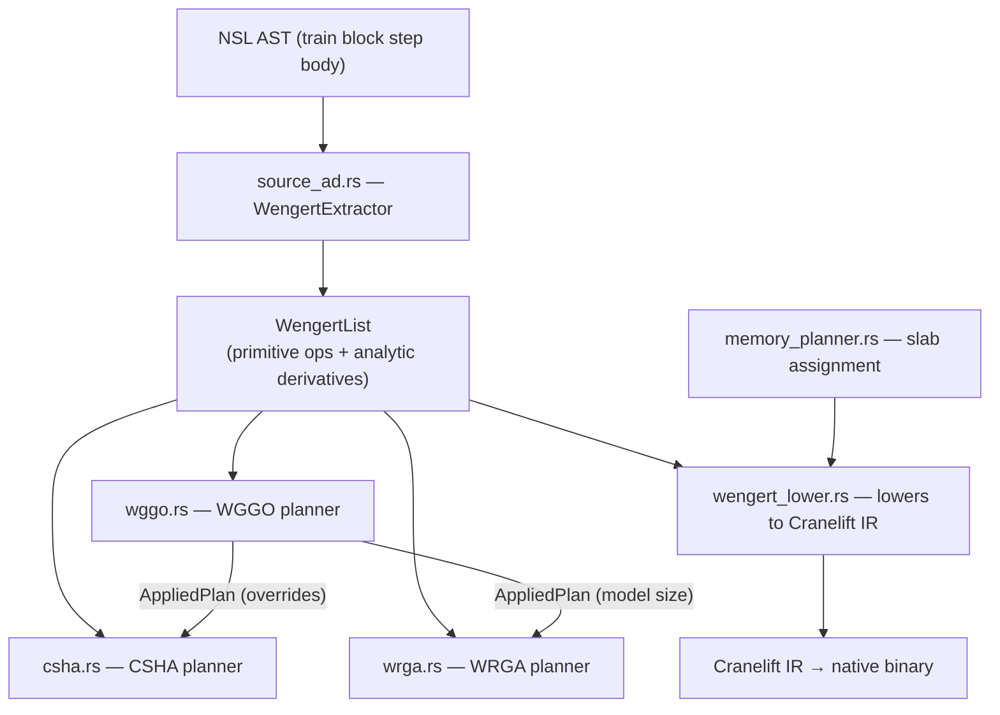

<!-- owner: @bwiemz -->

# Optimization Passes

NSL's compile-time optimization passes are the reason programs outperform a naive PyTorch transliteration. Each pass is an IR rewrite or a specialized code-synthesis step that runs before Cranelift emits the final binary. This page explains which passes exist, why they run in the order they do, and how to add a new one.

For the surrounding compiler stage, see [Compiler-Pipeline § Stage 4](Compiler-Pipeline.md#stage-4--codegen). Remember: **Cranelift is the sole function-emission backend**; passes described here either (a) rewrite the IR that Cranelift consumes, or (b) synthesize PTX text that gets embedded as a Cranelift data section.

## AOT autodiff — the WengertList

Source: [`crates/nsl-codegen/src/source_ad.rs`](../../crates/nsl-codegen/src/source_ad.rs).

NSL has **two** autodiff paths:

- **AOT (ahead-of-time) source AD** — `source_ad.rs` (`WengertExtractor`) walks the AST of a `train` block's step body and builds a `WengertList` (a straight-line SSA DAG of primitive ops plus their analytic derivatives) at compile time. The `WengertList` is then lowered by [`wengert_lower.rs`](../../crates/nsl-codegen/src/wengert_lower.rs) into **Cranelift IR** (as FFI calls into the NSL runtime). This is the fast path; dead-gradient elimination (`eliminate_dead_gradients`, `eliminate_by_backward_live`) prunes adjoint ops that contribute nothing to any trainable parameter.
- **Tape-based dynamic AD** — the fallback for constructs `source_ad.rs` cannot prove (dynamic shapes, data-dependent control flow). The step body falls back to `compile_tape_backward`. Slower; the downstream `WengertList` passes (WGGO, CSHA, WRGA) do not apply because no `WengertList` is produced. See [Runtime-Internals § Autodiff tape](Runtime-Internals.md#autodiff-tape) for raw pointer lifetime discipline.

When source AD extraction succeeds, the `WengertList` becomes the shared input for every downstream optimization pass (WGGO, CSHA, WRGA).


```mermaid
graph TD
    AST["NSL AST (train block step body)"]
    SAD["source_ad.rs — WengertExtractor"]
    WGT["WengertList\n(primitive ops + analytic derivatives)"]
    WGGO["wggo.rs — WGGO planner"]
    CSHA["csha.rs — CSHA planner"]
    WRGA["wrga.rs — WRGA planner"]
    MP["memory_planner.rs — slab assignment"]
    WL["wengert_lower.rs — lowers to Cranelift IR"]
    CL["Cranelift IR → native binary"]

    AST --> SAD
    SAD --> WGT
    WGT --> WGGO
    WGT --> CSHA
    WGT --> WRGA
    WGT --> WL
    WGGO -->|"AppliedPlan (overrides)"| CSHA
    WGGO -->|"AppliedPlan (model size)"| WRGA
    MP --> WL
    WL --> CL
```

Note: `WengertList` does NOT lower to PTX. Subsystem fusion passes (CSHA, WRGA, FlashAttention-2) synthesize PTX separately via their own templated emitters — see the per-subsystem sections below.

> **Diagram scope:** The diagram shows WengertList consumers only; FASE planning runs before source AD, and the diagram omits CPDT's `AppliedPlan` consumption — see per-pass sections below for the full picture.

## Memory planning — the slab allocator

Source: [`crates/nsl-codegen/src/memory_planner.rs`](../../crates/nsl-codegen/src/memory_planner.rs).

M36 (compile-time memory planning) solves a liveness-based packing problem over the full program AST:

1. **`analyze_ast_liveness`** — walks the AST to find every static-shape tensor allocation and record its live interval (birth program-point to last-use program-point).
2. **`InterferenceGraph::build`** — constructs an interference graph where nodes are tensors and edges connect tensors that are simultaneously live.
3. **`plan_slab`** — colors the interference graph greedily; assigns each tensor a contiguous offset inside a single GPU memory slab. Non-interfering tensors share memory.
4. At program startup the slab is initialized by a single `nsl_gpu_slab_init` call (see [`compiler/main_entry.rs`](../../crates/nsl-codegen/src/compiler/main_entry.rs)); per-tensor offsets are constant-folded into the emitted Cranelift IR.

The memory planner runs **after** `compile_user_functions` and **before** `compile_main` (see [`compiler/entry_points.rs`](../../crates/nsl-codegen/src/compiler/entry_points.rs)). This sequencing is load-bearing: the slab plan must be complete before `compile_main` emits the initialization call.

**Verification target: 0 MB/step allocation growth.** If your change regresses this, the slab plan is incorrect. Use [`memory_timeline.rs`](../../crates/nsl-codegen/src/profiling/memory_timeline.rs) to inspect per-step allocation events. The `--memory-report` flag (`check_vram_budget` / `format_memory_report`) surfaces the slab summary at build time. A non-zero per-step delta in `--memory-report` output indicates the slab plan is missing a tensor; the build still succeeds, but the runtime allocator will repeatedly grow. Detect by diffing `--memory-report` output across commits or by running `nsl profile` and checking the `memory_timeline` section for a flat plateau rather than stable zero-growth.

## Pass ordering

The optimization passes that operate on the `WengertList` run inside `compile_train_block` (invoked from `compile_main`). The order, as read from [`crates/nsl-codegen/src/stmt.rs`](../../crates/nsl-codegen/src/stmt.rs), is:

1. **FASE planning** — `fase::plan` / `fase::plan_with_overrides` is called **first**, before source AD, using `wggo_overrides` stashed by a prior WGGO run (or `None` on a fresh compile). Produces a `FasePlan` describing accumulation mode, update rule, and two-phase clip structure. FASE codegen (applying the plan) fires later in the same function.
2. **Source AD extraction** — `WengertExtractor::extract_stmts` builds the `WengertList`.
3. **Calibration** — optional; runs the calibration harness and populates `calibration_sidecar` if `--calibration-data` is set. Feeds gradient-importance scores to WGGO.
4. **WGGO** — `wggo::run_on_wengert_with_weights`; consumes the `WengertList` and emits a `WggoPlan` + `AppliedPlan`. Stashes `WggoOverrides` for all downstream passes (and for the NEXT compile's FASE planning).
5. **CSHA** — `csha::run_on_wengert`; consumes the `WengertList` + `WggoOverrides`; emits a `CshaPlan` and bridges it into kernel-site annotations (the `csha_bridge` channel — see the pass bus below).
6. **WRGA** — `invoke_wrga_if_enabled`; consumes the `WengertList`; runs dead-gradient elimination (`wrga_prune`), rank allocation (`wrga_roofline`), memory planning (`wrga_memory`), and fusion decisions (`wrga_fusion`).
7. **CPDT** — `invoke_cpdt_if_enabled`; consumes the `AppliedPlan` from WGGO. **CPDT is a no-op unless WGGO produced a plan first.**
8. **Source-AD adjoint generation + lowering** — `AdjointGenerator` rewrites the pruned `WengertList` into an adjoint program; `wengert_lower` lowers it to Cranelift IR.
9. **CCR (Compiler-Chosen Recomputation)** — straddles step 8. Its *planning* half (`ccr::plan`, `select_partition_dp`, `apply_budget`) runs on the PRIMAL tape before `AdjointGenerator`, segmenting per transformer block and classifying each result as escaping or interior; its *rewriting* half (`apply_to_adjoint`, `splice_decompress`, `insert_adjoint_last_use_frees`) then early-frees the interiors and splices recompute clones into the generated adjoint. Driven by `--checkpoint-blocks` / `--checkpoint-stride`; see the per-pass description below.
10. **Memory planner (M36)** — runs after all user-function bodies are compiled, before `compile_main`. See above.

**Pass ordering is load-bearing.** FASE planning reads `wggo_overrides` from the compiler state, which is set by a prior WGGO run — on a fresh first-pass compile, FASE falls back to `fase::plan` (no overrides). CSHA receives WGGO's `AppliedPlan` (via `WggoOverrides`) so per-layer fusion-level decisions from WGGO are honoured — or rejected with a diagnostic — by CSHA. CPDT hard-depends on WGGO: if `--wggo` is absent, the `cpdt_plan` channel is never published. The memory planner (M36) must run after `compile_user_functions` and before `compile_main`; reversing this order means the slab-initialization call is emitted before the plan is computed.

## Observing which passes ran (`NSL_PASS_TRACE`)

Set `NSL_PASS_TRACE=1` on any `nsl build` / `nsl run` / `nsl check` / `nsl test` and the compiler prints a `[pass-trace]` report to **stderr** just before it exits. It answers two questions the pass registry cannot: *was this pass reached*, and *what did it do*.

```
$ NSL_PASS_TRACE=1 nsl run --source-ad --wggo full model.nsl
[pass-trace] 2 pass(es) ran: WGGO(OnWengert)@KernelPrepass -> FASE(PreExtraction)@TrainBlock
[pass-trace] did not run: CCR, CSHA, WRGA, CPDT, PCA, CPKD, CEP, CFIE, MemoryPlanner
[pass-trace] WGGO: applied, 3 rewrite(s)
[pass-trace] FASE: applied, 2 rewrite(s)
```

The three kinds of line, and why each exists:

- **`N pass(es) ran: …`** — the passes actually reached, in first-invocation order, each tagged `NAME(DeclaredStage)@ObservedPhase`. A flag that enables a pass which never runs produces a clean, plausible, wrong build; this line is what makes that visible. The `@Phase` half is the driver scope the pass was reached from, and is `unattributed` for a pass that ran outside every declared scope — which is how a NEW driver announces itself instead of being discovered months later.
- **`did not run: …`** — the registered passes that were never reached. The absence is the interesting half: a report showing only what happened would make "nothing ran" indistinguishable from "the trace is broken".
- **`NAME: <disposition>`** — one line per pass that reported an *effect*. `applied, N rewrite(s)`; `declined, <category> - <detail>` where the category is one of `mode off` / `no candidates` / `precondition violated` / `feature disabled` / `budget infeasible`; or `advisory only` for a pass that produces a report nothing consumes (CEP's architecture search, CPKD's build report).

The distinction between the second and third kinds is the point of the disposition. Before it, "CSHA did not run" and "CSHA ran and found no attention chain it could fuse" were the same line, and only one of them is a bug. A pass that changed nothing reports a **decline with a reason**, never `applied, 0` — a hard-coded zero is exactly what a broken counter looks like, so zero is not how "nothing happened" is spelled.

Two things the trace deliberately does not do:

- It does **not** infer effect from invocation. `nsl check --training-report` builds its report BY running the FASE and PCA planners, so those are reported as having run — accurate under this definition, but "ran" must not be read as "affected the emitted program". The disposition line is what says that.
- It does **not** change the build. The whole mechanism is two compiler-side vectors of `Copy` data; nothing is emitted into the compiled program. `crates/nsl-cli/tests/pass_trace_gate.rs` pins that by comparing loss streams with the trace on and off.

Implementation: [`crates/nsl-codegen/src/pass_trace.rs`](../../crates/nsl-codegen/src/pass_trace.rs), printed from `emit_pass_trace` in [`crates/nsl-cli/src/commands/build/mod.rs`](../../crates/nsl-cli/src/commands/build/mod.rs).

## How passes reach each other: the pass bus (`[pass-bus]`)

The trace above answers *which passes ran*. It does not answer how one pass's
output reaches another. That happens through the **pass bus**: twelve channels
on `compiler.bus`, each filled by exactly one pass and read by later stages.

| Channel | Producer | Read by |
| --- | --- | --- |
| `csha_bridge` | CSHA | the FlashAttention call site, Wengert lowering |
| `csha_claimed_ops` | CSHA | `Compiler::is_csha_claimed` |
| `csha_backward_claims` | CSHA | the source-AD reverse walk, CCR's claim exemption |
| `wrga_plan` | WRGA | adapter init/inject, `compile*_returning_plan` |
| `adapter_prescan_plan` | WRGA | train-block adapter injection |
| `adapter_sites` | WRGA | adapter rewrite, synthesized-field access |
| `cpkd_plan` | CPKD | the distillation build report |
| `cpdt_plan` | CPDT | the precision-adaptive optimizer path |
| `cfie_plan` | CFIE | the build report |
| `cfie_serve_gen` | CFIE | the `generate()` rewrite |
| `wggo_overrides` | WGGO | FASE recipe selection, the per-parameter mode table, CSHA's and WRGA's inputs |
| `wggo_preplans` | WGGO | kernel synthesis, the train-block driver |

These are the edges a future pass *manager* would order by. `PipelineStage`
cannot do that job — `WGGO(OnWengert)` runs before `FASE(PreExtraction)`
because a different driver invokes it — but a data dependency orders by
construction: `wggo_overrides` is exactly why FASE must follow WGGO, whatever
their declared stages imply.

The same `NSL_PASS_TRACE=1` prints one line per channel that saw traffic:

```
[pass-bus] csha_bridge: published 1x by CSHA, read 5x full, 0x empty
[pass-bus] wrga_plan: published 0x by WRGA, read 0x full, 3x empty
```

`full` reads got a value; `empty` reads found the channel unfilled and took
their fallback branch. Channels with no traffic at all are omitted. Two
patterns are reported as findings rather than counts:

- **`DEAD OUTPUT`** — a pass filled a channel and nothing ever read a value out
  of it. The pass computed something for nobody. This tree has produced that
  defect repeatedly (an autotuner chooser with zero production callers; a
  certification gate silently off), and it was previously only ever found by
  someone grepping.
- **`SILENT DEFAULT`** — a consumer read an empty channel *although the
  producing pass ran and reported applying a transformation*. Every consumer's
  `None` branch is a working fallback, so this is invisible from every layer
  above; the finding names the channel and says what the fallback does.

`SILENT DEFAULT` deliberately does **not** fire when the producer merely ran: a
pass that runs and *declines* leaves its channel empty by definition, and that
decline is already reported on its disposition line. Only the contradiction —
applied, yet empty — is a finding.

Fields on the bus are private to `pass_bus.rs`, so the accessors are the only
way to reach a channel and the counts cannot be incomplete. Adding a channel
without declaring it fails
[`pass_bus_drift.rs`](../../crates/nsl-codegen/tests/pass_bus_drift.rs).

Implementation: [`crates/nsl-codegen/src/pass_bus.rs`](../../crates/nsl-codegen/src/pass_bus.rs).

## Per-pass descriptions

### CCR — Compiler-Chosen Recomputation

Source: [`crates/nsl-codegen/src/ccr.rs`](../../crates/nsl-codegen/src/ccr.rs). Research background: [`docs/research/CCR.pdf`](../../docs/research/CCR.pdf).

Block-granular activation checkpointing on the decorator-free source-AD path. The source-AD lowerer retains every primal intermediate until end-of-backward, so the activation wall is O(layers × per-layer intermediates); CCR converts it to O(layers × boundary tensors + one block's interiors). The pass:

1. **Segments** the flat inlined primal tape into per-transformer-block ranges using the same `blocks.N` parameter-name prefixes WGGO uses (`wggo_graph::layer_prefix`).
2. **Classifies** each in-segment result: *escaping* (consumed by a later primal op — the residual stream and anything else crossing the block boundary) stays SAVED; *interior* (consumed only inside the segment and/or by the adjoint) becomes RECOMPUTE.
3. **Early-frees** the original interiors right after the forward.
4. **Splices** clones of the interior-producing ops into the adjoint immediately before the first adjoint op that consumes them, remapping those consumers.
5. **Frees** each recomputed tensor right after the last adjoint op that consumes it.

Recompute clones run the same kernels in the same order on the same inputs, so the transform is **bit-exact**. Ops with non-replayable semantics (Dropout — RNG) are force-saved, and segments owned by a CSHA backward claim are exempted (the claim table is keyed by primal `OpId`, which a clone cannot satisfy).

Driven by `--checkpoint-blocks`, with `--checkpoint-selective` (never recompute matmul-class ops), `--checkpoint-budget-mib` (knapsack flips the most expensive-to-recompute tensors back to SAVE within budget), and `--checkpoint-stride` (coalesce every N block anchors into one super-segment; `auto` searches strides against the budget). Codegen integration lives in `stmt.rs` (`CcrPolicy`, `DpCostModel`, `select_partition_dp`, `plan_with_kept_anchors`, `project_activation_peak`).

Fires: **source-AD backward only**, and only on models with `blocks.N`-style structure — otherwise it is a no-op with a stderr note.

---

### FASE — Fused Accumulation + Step + Epilogue

Source: [`crates/nsl-codegen/src/fase.rs`](../../crates/nsl-codegen/src/fase.rs) (core analysis), [`fase_optimizer.rs`](../../crates/nsl-codegen/src/fase_optimizer.rs) (update-rule codegen), [`fase_memory.rs`](../../crates/nsl-codegen/src/fase_memory.rs) (per-layer slot scheduling), [`fase_clip.rs`](../../crates/nsl-codegen/src/fase_clip.rs) (two-phase grad-clip), [`stmt_fase.rs`](../../crates/nsl-codegen/src/stmt_fase.rs) (codegen integration).

Design specs: [`docs/superpowers/specs/2026-04-14-fase-deferred-codegen-integration-design.md`](../../docs/superpowers/specs/2026-04-14-fase-deferred-codegen-integration-design.md), [`2026-04-15-fase-codegen-phase2-design.md`](../../docs/superpowers/specs/2026-04-15-fase-codegen-phase2-design.md).

Given a `train` block configuration (optimizer, gradient accumulation count, clipping setting), `fase::plan` produces a `FasePlan` that the backward-codegen stage consumes. The plan describes: (1) whether to rewrite the backward at all (active only when `accumulation > 1`); (2) whether to run in **Deferred** mode (first-moment accumulation) or **Full** mode (standard gradient buffer, used when the optimizer does not match FASE invariants, e.g. Lion); (3) the mathematical update rule for the chosen optimizer, already specialised to the accumulation count; (4) the two-phase structure when `grad_clip` is enabled. The driver is pure — no state, no I/O — and produces the same output given the same inputs. PTX emission for the fused backward is handled by `fase_optimizer.rs` and `fase_memory.rs`.

Fires: **train-block only** (both planning and codegen run inside `compile_train_block`). The plan is a no-op (`FaseMode::Full` with N=1 scale) when `accumulation == 1`. Forward-only compilation and inference are unaffected.

---

### WGGO — Wengert Graph Global Optimization

Source: [`crates/nsl-codegen/src/wggo.rs`](../../crates/nsl-codegen/src/wggo.rs) (driver), plus sub-modules: [`wggo_cost.rs`](../../crates/nsl-codegen/src/wggo_cost.rs), [`wggo_dp.rs`](../../crates/nsl-codegen/src/wggo_dp.rs), [`wggo_gradient_scorer.rs`](../../crates/nsl-codegen/src/wggo_gradient_scorer.rs), [`wggo_apply.rs`](../../crates/nsl-codegen/src/wggo_apply.rs), [`wggo_conflicts.rs`](../../crates/nsl-codegen/src/wggo_conflicts.rs).

Research paper: [`docs/research/NSL-WGGO-Research.md.pdf`](../../docs/research/NSL-WGGO-Research.md.pdf).

The WGGO driver orchestrates eight stages (§5 of the research paper): (1) Wengert graph extraction (from `wengert.rs`); (2) cost-model annotation (`wggo_cost::build_lut`); (3) optional weight-analysis; (4) Level 1 inter-layer DP (`wggo_dp::solve`); (5) Level 2 per-layer ILP (greedy or templated solvers in `wggo_ilp`); (6) Level 3 kernel generation (delegated to backend); (7) memory planning (delegated to M36 `memory_planner.rs`); (8) communication schedule (`wggo_schedule::build_schedule`). The driver is pure data-in / data-out and has no backend side effects. It produces a `WggoPlan` (with embedded `AppliedPlan`) that all downstream passes consume as `WggoOverrides`. WGGO's `CoarseDecision::Prune` decisions are surfaced as `[prune]` diagnostics to stderr and, for sub-block layers, applied by the layer-to-residual-identity IR rewrite in `wggo_prune.rs` (`apply_rewrite` repoints consumers to `h_before` and deletes the pruned closure ops plus the residual Add), wired at the train-block lowering site. Whole-block prune (`LayerRole::Block`) is explicitly refused in v1 per spec §3.6 (the v2 chain-collapse rewrite remains deferred), so those decisions are reported but not applied.

Fires: **train-block, when `--wggo <mode>` is set.** Pure advisory on forward-only builds.

**CLI flags** (on `nsl build`, unless noted):

| Flag | Values / default | Effect |
| --- | --- | --- |
| `--wggo <mode>` | `full` \| `greedy` \| `off`; bare `--wggo` ⇒ `full`; absent ⇒ off | Selects the global-optimization mode. `full` runs the inter-layer DP + per-layer ILP + conflict resolution; `greedy` skips the ILP and re-costs the resolved config, escalating layers that regress > 5%; `off` runs each pass independently. |
| `--wggo-report` | off | Prints the global-optimization report to stderr, including the **Warnings / limitations** section (degradation notices, weights-load failures). |
| `--wggo-weights <path>` | none | A `.nslweights` sidecar for real weight-based head-importance scoring. On load failure WGGO falls back to uniform scores and records a warning in the report. |
| `--wggo-importance <mode>` | `auto` (default) \| `magnitude` \| `grad` | Head-importance scoring source. `auto` uses gradient scoring when a calibration sidecar is present, else magnitude; `grad` errors if no sidecar is present. |
| `--wggo-prune-fraction <F>` | `0.25`, clamped `[0.0, 0.9]` | Fraction of heads the default `min_retained_importance` threshold may prune. |
| `--devices <N>` | `1` | Cluster size (compile-time `world_size`). Drives WGGO's ZeRO-sharding budget — the DP only shards (`shard > 1`) when `N > 1` and memory pressure requires it. Unlike `nsl run --devices`, this spawns no processes; it only informs the plan. |
| `--explain-wggo` *(on `nsl profile`)* | off | Runs WGGO Full and emits a per-layer decision explanation covering all six dimensions: CEP (head prune), CSHA (fusion level), WRGA (adapter rank/placement), CPDT (optimizer precision), FASE (fused step), PCA (sequence packing). |

Full multi-GPU invocation with a report:

```sh
nsl build model.nsl --source-ad --emit-obj -o model_out \
  --devices 8 \
  --wggo full --wggo-report \
  --wggo-weights model.nslweights \
  --wggo-importance auto \
  --wggo-prune-fraction 0.3
```

If `--wggo full` is infeasible for the given `--devices` / memory budget, WGGO degrades **Full → Greedy → Off**, recording a warning at each step rather than silently producing an over-budget plan.

---

### CSHA — Compiler-Synthesized Holistic Attention

Source: [`crates/nsl-codegen/src/csha.rs`](../../crates/nsl-codegen/src/csha.rs) (driver), plus sub-modules: [`csha_boundary.rs`](../../crates/nsl-codegen/src/csha_boundary.rs), [`csha_pipeline.rs`](../../crates/nsl-codegen/src/csha_pipeline.rs), [`csha_specialize.rs`](../../crates/nsl-codegen/src/csha_specialize.rs), [`csha_patterns.rs`](../../crates/nsl-codegen/src/csha_patterns.rs), [`csha_apply.rs`](../../crates/nsl-codegen/src/csha_apply.rs).

Research paper: [`docs/research/NSL-CSHA-Research.PDF`](../../docs/research/NSL-CSHA-Research.PDF).

Design specs: [`docs/superpowers/specs/2026-04-13-csha-tier-a-wiring-design.md`](../../docs/superpowers/specs/2026-04-13-csha-tier-a-wiring-design.md), [`2026-04-15-csha-tier-c-fused-backward-design.md`](../../docs/superpowers/specs/2026-04-15-csha-tier-c-fused-backward-design.md).

The CSHA driver orchestrates three passes (§3 of the research paper): (1) Level 1 boundary fusion (`csha_boundary`) — identifies adjacent attention sub-ops (RMSNorm, RoPE, matmul projections, softmax) that can be merged into a single tiled GPU kernel; (2) Level 2/3 pipelining/blocking (`csha_pipeline`) — selects tile configurations and SMEM budgets using a roofline model; (3) per-layer specialization (`csha_specialize`) — applies weight-aware and head-count-aware tuning. The driver is pure data-in / data-out; it receives `WggoOverrides` and honours (or rejects with a diagnostic) any per-layer fusion-level decision WGGO made. The resulting `CshaPlan` is bridged into the `csha_bridge` channel so FlashAttention-2 call sites can route CSHA-active layers through CSHA-aware FFI. Synthesized FlashAttention-2 PTX (forward + backward) is emitted by [`compiler/kernel.rs::maybe_synthesize_csha_training_ptx`](../../crates/nsl-codegen/src/compiler/kernel.rs) and embedded as Cranelift data sections.

Fires: **`@flash_attention`-annotated models inside `@train`, when `--csha <mode>` is set.**

---

### WRGA — Wengert-Pruned Roofline-Guided Adaptation

Source: [`crates/nsl-codegen/src/wrga_prune.rs`](../../crates/nsl-codegen/src/wrga_prune.rs) (Innovation 1 — dead gradient elimination), [`wrga_roofline.rs`](../../crates/nsl-codegen/src/wrga_roofline.rs) (Innovation 2 — roofline-guided adapter kind selection), [`wrga_spectral.rs`](../../crates/nsl-codegen/src/wrga_spectral.rs) (Innovation 3 — randomized-SVD rank allocation), [`wrga_fusion.rs`](../../crates/nsl-codegen/src/wrga_fusion.rs) (Innovation 4 — fusion-integrated adapters), [`wrga_memory.rs`](../../crates/nsl-codegen/src/wrga_memory.rs) (Innovation 5 — activation-sharing memory planner). The WRGA driver that sequences these is invoked via `invoke_wrga_if_enabled` in [`stmt.rs`](../../crates/nsl-codegen/src/stmt.rs). Adapter-site pre-scan and model-method body rewrite are in [`wrga_prescan.rs`](../../crates/nsl-codegen/src/wrga_prescan.rs).

Research paper: [`docs/research/NSL-WRGA-Research.PDF`](../../docs/research/NSL-WRGA-Research.PDF).

Design specs: [`docs/superpowers/specs/2026-04-13-wrga-milestone-b3-design.md`](../../docs/superpowers/specs/2026-04-13-wrga-milestone-b3-design.md), [`2026-04-19-wrga-b32-option3-revised-design.md`](../../docs/superpowers/specs/2026-04-19-wrga-b32-option3-revised-design.md).

WRGA composes five innovations. Innovation 1 (`wrga_prune`) performs **dead gradient elimination**: given a `WengertList` and a set of trainable `VarId`s, it identifies the minimal subset of forward ops that participate in the backward pass and emits a pruned list — adjoint ops for frozen or irrelevant parameters are never generated. Innovation 2 (`wrga_roofline`) performs **roofline-guided adapter kind selection**: for each candidate attention site it compares memory bandwidth vs compute ratios against the target GPU's roofline model and recommends the adapter kind (LoRA at a computed rank, IA³ scaling vector, GatedLoRA, or none) that best exploits the site's bottleneck — the exact recommendation differs between architectures like an RTX 5070 Ti and an H100 for the same model. Innovation 3 (`wrga_spectral`) performs **randomized-SVD rank allocation under a parameter budget**: it approximates the spectral entropy and effective rank of each 2-D weight matrix using a randomized SVD (Halko–Martinsson–Tropp, 2011) and allocates per-layer LoRA ranks proportionally, keeping total adapter parameter count within the user-specified budget while concentrating rank where it matters most. Innovation 4 (`wrga_fusion`) decides, per adapter site, whether the LoRA or IA³ adapter can be epilogue-fused into the host matmul or norm kernel. Innovation 5 (`wrga_memory`) solves activation-sharing via interference-graph colouring over Wengert `VarId` liveness, reusing the same greedy-colouring heuristic as M36 `memory_planner.rs` but driving it from the pruned backward graph (which is nearly trivial to colour because ~85% of forward ops carry no adjoint). Adapter site pre-scanning (`wrga_prescan`) rewrites `model_method_bodies` so the source-AD extractor sees fused FFI callees rather than raw PyTorch-style adapter calls. Fused LoRA / IA³ / GatedLoRA PTX is synthesized by [`wrga_fused_ptx.rs`](../../crates/nsl-codegen/src/wrga_fused_ptx.rs) and registered at startup via `emit_fused_ptx_registration`.

Fires: **train-block, when `@adapter` decorators are present and `--wrga` is set (or `NSL_WRGA_FUSED_CUDA=1`).**

---

### CPDT — Compile-time Parallelism & Distributed Training

Source: [`crates/nsl-codegen/src/cpdt.rs`](../../crates/nsl-codegen/src/cpdt.rs) (driver), plus sub-modules: [`cpdt_zero.rs`](../../crates/nsl-codegen/src/cpdt_zero.rs) (ZeRO planning), [`cpdt_comm.rs`](../../crates/nsl-codegen/src/cpdt_comm.rs) (comm scheduling), [`cpdt_tier_apply.rs`](../../crates/nsl-codegen/src/cpdt_tier_apply.rs) (precision selection), [`cpdt_optim.rs`](../../crates/nsl-codegen/src/cpdt_optim.rs) (quantized optimizer codegen), [`cpdt_expert.rs`](../../crates/nsl-codegen/src/cpdt_expert.rs) (expert placement), [`cpdt_joint.rs`](../../crates/nsl-codegen/src/cpdt_joint.rs) (joint ZeRO + precision + expert solver; core driver of `CpdtMode::Full`). Note: [`cpdt_sensitivity.rs`](../../crates/nsl-codegen/src/cpdt_sensitivity.rs) is an internal scoring helper used inside `cpdt_tier_apply`, not a top-level pass.

Research paper: [`docs/research/CPDT Research.pdf`](<../../docs/research/CPDT Research.pdf>).

Design specs: [`docs/superpowers/specs/2026-04-15-cpdt-pipeline-integration-design.md`](../../docs/superpowers/specs/2026-04-15-cpdt-pipeline-integration-design.md), [`2026-04-18-cpdt-weight-aware-phase1-design.md`](../../docs/superpowers/specs/2026-04-18-cpdt-weight-aware-phase1-design.md).

The CPDT driver composes five passes into a single `CpdtPlan`: (1) ZeRO evaluation — chooses the ZeRO stage (0, 1, 2, or 3) based on cluster topology and model size derived from WGGO's `AppliedPlan`; (2) communication schedule — builds the AllReduce / ReduceScatter / AllGather sequence for the chosen ZeRO stage; (3) precision selection (`cpdt_tier_apply::plan_map`) — assigns fp32 / fp16 / int8 / int4 tiers per-layer using weight-aware calibration data when `--weights` is supplied; (4) quantized optimizer codegen — emits the fused AdamW step for the selected precision; (5) expert placement — assigns MoE expert shards to GPUs. When `CpdtMode::Full` is active, `cpdt_joint.rs` drives an iterative joint solver that alternates between fixing expert placement while optimising ZeRO + precision and fixing ZeRO + precision while optimising expert placement, converging in 3–5 iterations. The driver is pure and deterministic. **CPDT is a no-op unless WGGO produced a plan first** (`invoke_cpdt_if_enabled` checks `wggo_applied`). The `@cpdt(weight_aware=false)` decorator opts individual models out of weight-aware precision selection; the compiler enforces that at most one `@cpdt` decorator appears per program.

Fires: **train-block, when `--cpdt` is set and WGGO produced an `AppliedPlan`.**

### PCA — Packed Causal Attention

Source: [`crates/nsl-codegen/src/pca_detect.rs`](../../crates/nsl-codegen/src/pca_detect.rs) (variant detection), plus [`pca_segment.rs`](../../crates/nsl-codegen/src/pca_segment.rs) (segment-id construction), [`pca_activation.rs`](../../crates/nsl-codegen/src/pca_activation.rs) (dispatch/activation), [`pca_per_doc.rs`](../../crates/nsl-codegen/src/pca_per_doc.rs) (per-document CTA admission), [`pca_tier_b.rs`](../../crates/nsl-codegen/src/pca_tier_b.rs) (Tier-B kernels).

When a `dataset` block sets `packing = true`, many short documents are concatenated into one fixed-length sequence, and attention must not cross document boundaries. The naive encoding is a dense `S x S` boolean mask, which costs `O(S^2)` memory and bandwidth for information that is really `O(S)`. PCA replaces it with a compact `segment_ids: [u16; seq_len]` tensor and synthesises an attention kernel that compares segment ids instead of reading a mask.

`pca_detect` chooses between three variants: **SegmentIdMasked** (the general case, arbitrary document lengths), **PerDocumentCta** (documents short and roughly even — each CTA takes one whole document rather than one Q-tile), and **NoPacking** (packing disabled; ordinary FlashAttention).

Fires: **during kernel synthesis, when the dataset block enables packing.** PCA is not a `compile_train_block` pass and never sees the `WengertList` — `pca_activation::detect_packing_for_stmts` is called from `compiler/kernel.rs` as a scan over the module AST, before `compile_main`. Consequently it cannot consume WGGO's `AppliedPlan`. The `@pca(strategy = per_document)` decorator selects the per-document-CTA path; it does not by itself enable packing, and the detector recommending `PerDocumentCta` does not by itself enable it either. No CLI flag.

### CPKD — Compiler-Planned Knowledge Distillation

Source: [`crates/nsl-codegen/src/cpkd.rs`](../../crates/nsl-codegen/src/cpkd.rs) (driver), plus [`cpkd_fused_loss.rs`](../../crates/nsl-codegen/src/cpkd_fused_loss.rs) (fused KL-CE kernel), [`cpkd_spectral.rs`](../../crates/nsl-codegen/src/cpkd_spectral.rs) (spectral logit compression), [`cpkd_student.rs`](../../crates/nsl-codegen/src/cpkd_student.rs) (CEP-guided student design).

Treats distillation as one compilation problem rather than two model executions. In a `distill(teacher=t, student=s, epochs=N)` block the **teacher is structurally frozen**: every teacher model field registers as a `PrimalOp::Input` leaf, so no adjoint is ever generated for it and the teacher backward is physically absent from the compiled step — there are no teacher gradient buffers to blow up memory. The `@fused_kl_ce` decorator additionally fuses both LM-head matmuls, the temperature-scaled KL term and the hard-label CE term into one kernel, so neither logit tensor is materialized in HBM.

Remaining paper innovations are **advisory** plan entries in v1 (spectral rank, WGGO per-layer feature-match choices, CEP-guided student design); v1 deferrals refuse loudly rather than degrading silently.

Fires: **distill-block.** Design-time analysis is driven by `--cpkd-target` / `--cpkd-design-student` on `nsl check`.

### CEP — Compilation-Evaluated Pruning

Source: [`crates/nsl-codegen/src/cep.rs`](../../crates/nsl-codegen/src/cep.rs) (driver), plus [`cep_extract.rs`](../../crates/nsl-codegen/src/cep_extract.rs), [`cep_importance.rs`](../../crates/nsl-codegen/src/cep_importance.rs), [`cep_rewrite.rs`](../../crates/nsl-codegen/src/cep_rewrite.rs), [`cep_search.rs`](../../crates/nsl-codegen/src/cep_search.rs), [`cep_slice.rs`](../../crates/nsl-codegen/src/cep_slice.rs).

Structured pruning verified by compilation rather than by a runtime proxy. Three CLI-reachable entry points: `run_prune` prunes a pre-trained model (`--cep-prune` / `@cep_prune`), `run_joint` runs joint prune-search over heads, FFN and layer drops (`--cep-joint`), and `run_search` performs hardware-aware architecture search (`--cep-search` / `@cep_search`). The driver is pure and deterministic — the same inputs always produce an identical report. (`cep.rs`'s own module doc still says "two user-facing entry points"; `run_joint` was added later.)

**Not a train-block pass.** CEP rewrites the model offline and emits new weights and/or new NSL source, so it sits outside the `compile_train_block` pass sequence. `--cep-search` and `--cep-profile` are analysis-only and live on `nsl check`; `--cep-prune`, `--cep-joint`, `--cep-sparsity`, `--cep-emit-source` and `--cep-emit-weights` perform surgery and live on `nsl build`; `--cep-target` and `--cep-out` are accepted by both.

### CFIE — Compiler-Fused Inference Engine

Source: [`crates/nsl-codegen/src/cfie.rs`](../../crates/nsl-codegen/src/cfie.rs) (driver), plus [`cfie_kv_plan.rs`](../../crates/nsl-codegen/src/cfie_kv_plan.rs), [`cfie_persistent.rs`](../../crates/nsl-codegen/src/cfie_persistent.rs), [`cfie_serve.rs`](../../crates/nsl-codegen/src/cfie_serve.rs), [`cfie_speculative.rs`](../../crates/nsl-codegen/src/cfie_speculative.rs).

Composes six inference passes — KV planning, fused sampling, speculative decoding, persistent decode + scheduler, KV quantization, and grammar-constrained decoding — into a single `CfiePlan`. Five of the six contribute a *kernel family*, and all five emit real PTX (KV planning shapes the pool rather than emitting a kernel of its own). On the monolithic `serve` path that PTX is embedded and registered with the runtime engine at serve init, and per-token launches go through the host decode loop.

**Not a train-block pass.** CFIE is invoked from `serve.rs::run_cfie_for_serve`, a separate driver entry point. Flags (`--cfie`, `--cfie-report`) live on `nsl build` only.

## Load-bearing invariants

Promoted from internal engineering notes. Violations of any of these have caused regressions:

- **Pass ordering is load-bearing.** CSHA must run after WGGO because it reads `WggoOverrides` set by WGGO; running CSHA before WGGO means every CSHA per-layer decision ignores WGGO's global optimality. CPDT must run after WGGO because it derives `ModelSize` from `AppliedPlan`; without a plan, CPDT silently no-ops. The memory planner (M36) must run after `compile_user_functions` and before `compile_main`; reversing this order means the slab-initialization call is emitted before the plan is computed.
- **Emitted PTX comments must be ASCII-only.** `ptxas` (offline) accepts Unicode; cudarc's JIT PTX loader (`cuModuleLoadDataEx`) rejects it with `CUDA_ERROR_INVALID_PTX`. The rule: every byte between `//` and `\n` in synthesized PTX must be in the range `[0x20, 0x7E]` or tab (`\t`). This applies to all PTX emitters — `backend_ptx.rs`, the CSHA hooks, the FlashAttention-v2 codegen, and the WRGA fused-PTX emitter. Em-dashes, smart quotes, and any other UTF-8 multi-byte sequences in PTX comment string literals will break GPU launches silently (the build succeeds; the launch fails at runtime).
- **`@flash_attention` defaults to `causal=true`.** A model that computes `row_sum = [1, 2, ..., N]` for the attention softmax under uniform inputs is **correct** behavior under a causal mask — each row attends to `row_idx + 1` keys. This ordinal pattern is produced by causal masking, not a save-path corruption. Non-causal attention requires the explicit `@flash_attention(causal=false)` annotation. The kernel name carries `c1` (causal) vs `c0` (non-causal) for disambiguation.

## How to add a new IR pass

1. Decide where it slots in the order documented above. If your pass produces optimizations the next pass depends on, slot it earlier. If it consumes optimizations a prior pass produces, slot it later. If your pass needs to run before source-AD extraction (step 2 of the pass order), it cannot consume the `WengertList` — it must operate on compiler state from a prior compile cycle (as FASE does with stashed `wggo_overrides`). This is the only pre-AD slot; coordinate with the pass-ordering maintainer before using it.
2. Write the pass as a function that takes a `&WengertList` (or an `AppliedPlan`) and returns a rewritten list or a new plan struct. Pure, no global state, no `eprintln!` outside a `NSL_DEBUG` gate.
3. Preserve invariants established by prior passes. If prior passes established that no two intermediates share a `VarId`, don't introduce duplicates.
4. Add a unit test that feeds a small hand-built `WengertList` and asserts the rewrite is correct.
5. Add a snapshot test (`insta`) that captures the pass's effect on a real `.nsl` example.
6. Register the pass invocation in the correct sequence inside `compile_train_block` in [`crates/nsl-codegen/src/stmt.rs`](../../crates/nsl-codegen/src/stmt.rs), following the ordering above.
7. If the pass interacts with memory planning, re-verify the 0 MB/step target using [`memory_timeline.rs`](../../crates/nsl-codegen/src/profiling/memory_timeline.rs) and the `--memory-report` flag.
8. Surface diagnostic output via a `[<passname>]` prefix on stderr (matching the `[wggo]`, `[csha]`, `[wrga]`, `[cpdt]`, `[fase]` conventions already established) gated behind `--<passname>-report`.
9. Add a `PassDescriptor` to [`crates/nsl-codegen/src/pass_registry.rs`](../../crates/nsl-codegen/src/pass_registry.rs) and a `### ` section under "Per-pass descriptions" above. The drift gates in `pass_registry_drift.rs` check both directions, so a pass that skips this fails CI rather than going undocumented.
10. Call `pass_trace::record("NAME")` at the pass's **entry** and `pass_trace::record_disposition("NAME", …)` at **every exit**, including the ones that decline. Both are required and neither substitutes for the other: `record` answers "was it reached", the disposition answers "what did it do", and a decline that reports nothing is indistinguishable from a flag that never arrived. Keep the name argument on the same line as the call — the static scan in `pass_registry_drift.rs` is line-based, and both its site-count floors will fail if an exit loses its disposition.

---

*Last structurally verified against commit `1d348624` on 2026-07-31. If the crate graph or pass order in this page no longer matches reality, open an issue tagged `docs-rot`.*
